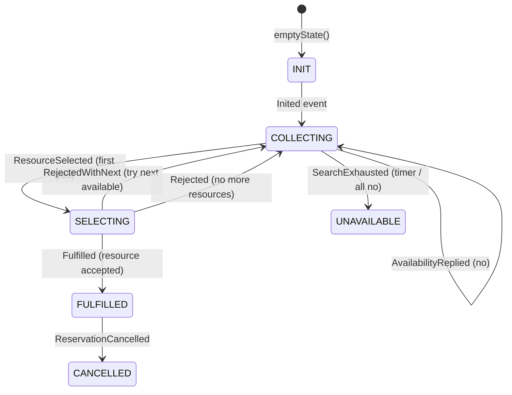

# Booking Flow

End-to-end walk-through of what happens when a player sends a message to the Telegram bot.

---

## ReservationEntity State Machine

See [fsm.md](fsm.md) for the full state diagram. Summary:



---

## Step-by-step Flow

### 1. TelegramEndpoint receives the webhook

`POST /telegram/{botToken}/webhook` — Telegram calls this for every incoming message.

- Looks up the facility by bot token via `FacilityByBotTokenView`.
  - If no facility is found (view empty / not yet populated), the request is dropped with a WARN log and **nothing further happens**.
- Builds a `sessionId = facilityId:chatId` (sanitised) to scope the conversation per user per facility.
- Calls `BookingAgent::chat` **asynchronously** (`invokeAsync`) and immediately returns HTTP 200 to Telegram.
- When the agent replies, sends the reply text back to the player via `NotificationSender`.

### 2. BookingAgent handles the message

`BookingAgent` is a stateful Akka Agent. The session preserves conversation history automatically.

- Constructs the system prompt with the current date (in the facility's timezone).
- Formats the user message as: `[facility:X] [recipient:Y] SenderName: <text>`
- Calls the LLM. The LLM may invoke `BookingService` tools (0 or more times) before generating a reply.

### 3. LLM tool calls — BookingService

The LLM uses two tools during a booking:

**`checkAvailability(facilityId, dateTimeIso)`**
- Queries `ResourceView` for all courts belonging to the facility.
- For each court, checks whether the requested time slot already exists in its `timeWindow`.
- Returns a human-readable list of free courts, or suggests nearby alternatives if all are taken.

**`bookCourt(facilityId, dateTimeIso, playerNames, recipientId)`**
- Generates a random 8-char `reservationId`.
- Registers a **14-second expiry timer** via `TimerScheduler` (fires `TimerAction::expire` if booking is not fulfilled in time).
- Calls `ReservationEntity::init` with the reservation data, the facility as the selection target, and the `recipientId` for later notification.
- Returns a confirmation string to the LLM (not sent to the player directly — the final LLM reply handles that).

### 4. ReservationEntity::init

- Guards: rejects if already in any non-INIT state.
- Persists `Inited` event containing: reservation (players + dateTime), selection (facility ID), recipientId.
- State: `INIT → COLLECTING`
- Returns `ReservationId` to the caller.

### 5. ReservationAction consumer reacts to Inited

`@Consume.FromEventSourcedEntity(ReservationEntity)` — runs as a projection.

- Calls `FacilityAction.broadcast()` which fans out an availability check to **every resource** registered on the facility.
- Each `ResourceEntity` checks its own time window for the requested slot and emits `AvalabilityChecked(available=true/false)`.

### 6. ResourceAction consumer reacts to AvalabilityChecked

- Calls `ReservationEntity::replyAvailability` with the resource's answer.
- Inside `ReservationEntity`:
  - First `true` reply → persists `ResourceSelected`, state: `COLLECTING → SELECTING`
  - `false` replies → recorded via `AvailabilityReplied(false)`, entity stays in `COLLECTING`

### 7. ReservationAction consumer reacts to ResourceSelected

- Calls `ResourceEntity::reserve` on the winning resource to actually lock the slot.

### 8. ResourceEntity processes the reserve command

- If the slot is still free: persists `ReservationAccepted`, locks the time slot in its state.
- If the slot was grabbed concurrently: persists `ReservationRejected`.

### 9a. ResourceAction consumer reacts to ReservationAccepted

- Calls `ReservationEntity::fulfill`.
- State: `SELECTING → FULFILLED`
- Cancels the expiry timer.

### 9b. ResourceAction consumer reacts to ReservationRejected

- Calls `ReservationEntity::reject`.
- If other available resources remain → `RejectedWithNext` event, state back to `COLLECTING`, retries with the next resource.
- If no resources remain → `Rejected` event, state: `SELECTING → COLLECTING` (awaits timeout).

### 10. DelegatingServiceAction consumer reacts to Fulfilled

- Looks up the resource name and calendar ID from `ResourceView`.
- Calls `CalendarSender.saveToGoogle()` to create a Google Calendar event.
- On success, calls `NotificationSender.send(recipientId, text)` with a confirmation message:
  ```
  ✅ Court booked!
  🎾 <court name>
  📅 <date/time>
  👥 <players>
  🆔 ID: <reservationId>
  <link to club calendar>
  ```

### Timeout path — TimerAction fires

If the 14-second timer expires before `FULFILLED`:

- `TimerAction::expire` → `ReservationEntity::expire`
- Persists `SearchExhausted`, state → `UNAVAILABLE`
- `DelegatingServiceAction` reacts to `SearchExhausted` and calls `NotificationSender.send()`:
  ```
  Sorry, no court was available for <dateTime>. Please try a different time.
  ```

### Cancellation path

- Player asks the agent to cancel → LLM calls `BookingService.cancelReservation(reservationId)`
- `ReservationEntity::cancelRequest` → persists `CancelRequested`, state: `FULFILLED → FULFILLED` (still fulfilled, waiting for resource ack)
- `ReservationAction` consumer reacts to `CancelRequested` → calls `ResourceEntity::cancel`
- `ResourceAction` consumer reacts to `ReservationCanceled` (from ResourceEntity) → calls `ReservationEntity::cancel`
- `ReservationEntity::cancel` → persists `ReservationCancelled`, state: `FULFILLED → CANCELLED`
- `DelegatingServiceAction` reacts to `ReservationCancelled`:
  - Deletes the Google Calendar event.
  - Sends `"Reservation <id> has been cancelled."` via `NotificationSender`.

---

## Component Map

| Component | Type | Role |
|---|---|---|
| `TelegramEndpoint` | HTTP Endpoint | Receives Telegram webhooks, dispatches to agent |
| `BookingAgent` | Agent | LLM conversation, tool orchestration |
| `BookingService` | Tool provider | `checkAvailability`, `bookCourt`, `cancelReservation` |
| `ReservationEntity` | Event-Sourced Entity | Reservation lifecycle state machine |
| `ResourceEntity` | Event-Sourced Entity | Per-court availability and booking |
| `FacilityEntity` | Event-Sourced Entity | Facility metadata (timezone, bot token, resources) |
| `ReservationAction` | Consumer | Reacts to ReservationEntity events → drives broadcast and resource reserve |
| `ResourceAction` | Consumer | Reacts to ResourceEntity events → drives ReservationEntity transitions |
| `DelegatingServiceAction` | Consumer | Reacts to terminal ReservationEntity events → calendar + notification |
| `TimerAction` | Timed Action | Fires expiry if booking not fulfilled within 14 s |
| `FacilityByBotTokenView` | View | Resolves bot token → facilityId (requires projections running) |
| `ResourceView` | View | Lists courts per facility; per-resource lookup by ID |
