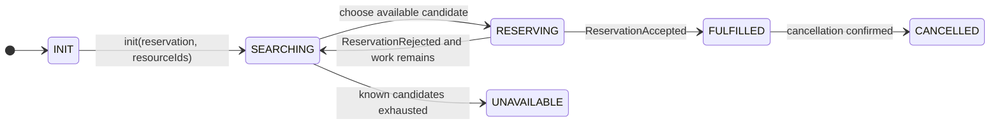

# Booking Flow

This document describes the target booking flow for the post-rearchitecture reservation engine.

It intentionally describes the timer-free design: the reservation engine receives the full candidate `resourceId` set at initialization time, so normal booking completion is driven by candidate exhaustion rather than by timeout.

## State Machine Summary

See [fsm.md](fsm.md) for the detailed state machine.

## End-to-End Flow

### 1. Caller creates a reservation request

A caller such as `BookingService` or `BookingEndpoint` sends:

- reservation payload
- full set of candidate `resourceId`s
- recipient / notification metadata

The reservation engine must know the complete candidate set at the start.

### 2. `ReservationEntity::init` enters `SEARCHING`

Initialization persists the reservation details together with the full candidate set.

The reservation should initialize bookkeeping like this:

- `pendingAvailability = candidateResourceIds`
- `availableCandidates = {}`
- `triedOrRejected = {}`
- `selectedResourceId = empty`

### 3. `ReservationAction` fans out availability checks

For every candidate resource, Rez sends `ResourceEntity.CheckAvailability`.

This step is only a filter. It does not lock anything.

### 4. Each `ResourceEntity` checks availability locally

Each resource:

- rounds the requested booking time to the valid slot boundary
- evaluates `isReservableAt(validTime)` against its own `timeWindow` and booking policy
- emits an availability result

A positive availability reply is advisory. Another reservation may still lock the slot first.

### 5. `ReservationEntity` accounts for each availability reply

Each reply removes that resource from `pendingAvailability`.

If the reply is negative:

- add the resource to `triedOrRejected`
- if nothing is pending, nothing is available, and no reserve is in flight, mark the reservation `UNAVAILABLE`

If the reply is positive:

- add the resource to `availableCandidates`
- if no reserve is currently in flight, choose one candidate and move to `RESERVING`

### 6. `ReservationAction` asks one resource to reserve

When the reservation chooses a candidate, Rez sends `ResourceEntity.Reserve` to exactly one selected resource.

This is the real lock attempt.

### 7. `ResourceEntity.reserve()` is the lock point

`reserve()` re-checks the slot against current resource state.

- if the slot is still free, the resource persists `ReservationAccepted` and writes the lock into `timeWindow`
- otherwise it persists `ReservationRejected`

That second check is what makes the slot-level algorithm safe under races.

### 8. `ResourceAction` forwards the reserve result back to the reservation

If the selected resource accepts:

- `ReservationEntity` persists `Fulfilled`
- the reservation moves to `FULFILLED`
- notification/calendar side effects happen afterward

If the selected resource rejects:

- mark that resource as tried
- clear `selectedResourceId`
- if another available candidate already exists, reserve it immediately
- otherwise, if availability replies are still pending, return to `SEARCHING` and wait
- otherwise, mark the reservation `UNAVAILABLE`

## Important Invariants

- Availability checks never lock a resource.
- Only `ReservationAccepted` on the resource acquires a lock.
- At most one resource may be in `reserve()` for a reservation at a time.
- `UNAVAILABLE` is a deterministic conclusion over the known candidate set, not a timeout guess.

## Failure Model

This design removes the business timeout from normal booking logic, but it does not by itself make the orchestration transactional.

The remaining architectural risk is cross-entity partial failure:

- an event consumer may acknowledge its source event
- a downstream `componentClient.invoke()` or `invokeAsync()` may then fail
- the workflow can be left partially advanced without automatic replay of the downstream command

That risk should be documented separately from the slot-locking algorithm.

## Operational Watchdog

An operational watchdog can still be useful for alerting or compensating stuck workflows, but it should be treated as operational safety only.

It should not be the primary way the reservation engine decides that a request is `UNAVAILABLE`.

## Cancellation

Cancellation remains a separate flow:

1. Reservation requests cancellation of its fulfilled resource.
2. Resource removes the slot lock if the reservation owns it.
3. Reservation records `CANCELLED` after the resource confirms cancellation.
