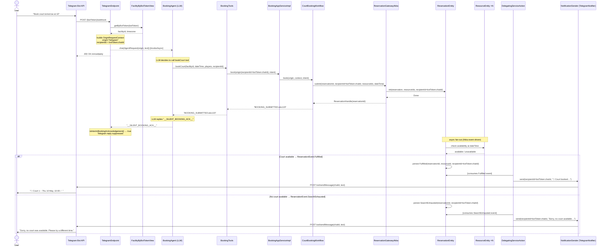
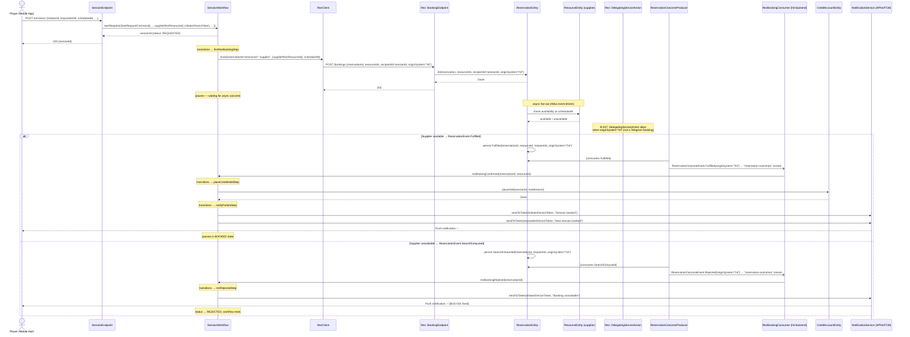

# Booking Sequence Diagrams

Two end-to-end flows showing how booking requests enter Rez and how outcomes are routed back to the origin system.

---

## 1 — Telegram court reservation

---

## 2 — Hit app supplier booking

---

## B-047 change map

| Step | Repo | Component | Change |
|------|------|-----------|--------|
| a | rez | `BookingEndpoint.BookingRequest` | add `String originSystem` (nullable) |
| a | rez | `ReservationEntity.Init` | add `String originSystem` |
| a | rez | `ReservationState` | store `originSystem` |
| a | rez | `ReservationEvent` variants | carry `originSystem` in Fulfilled, SearchExhausted, Rejected |
| a | rez | `ReservationOutcomeEvent` | add `String originSystem` to Fulfilled and Rejected |
| a | rez | `ReservationOutcomeProducer` | propagate `originSystem` into outcome events |
| a | rez | `DelegatingServiceAction` | skip if `originSystem != null && !originSystem.equals("telegram")` |
| b | hit-backend | `RezClient` | pass `originSystem = "hit"` |
| c | hit-backend | `RezOutcomeEvent` | add `String originSystem` |
| d | hit-backend | `RezBookingConsumer` | skip if `originSystem != null && !originSystem.equals("hit")` |
| BUG-001 | hit-backend | `SessionWorkflow.rezRejectedStep` | send push notification before `thenEnd()` |
