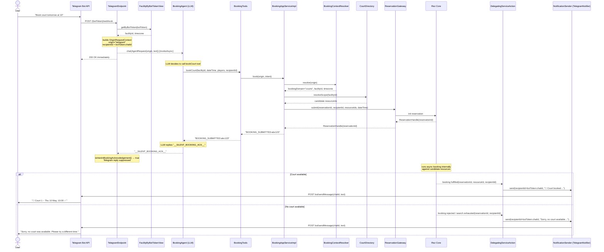
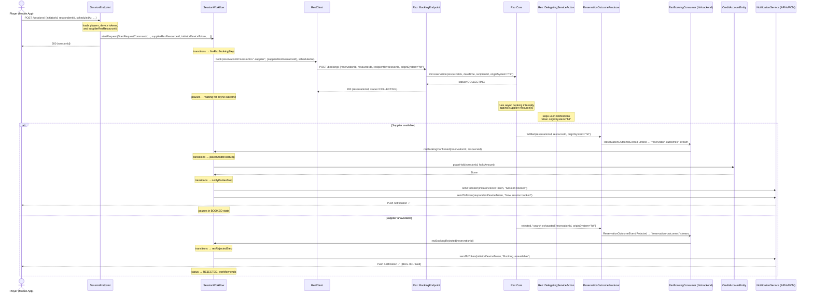

# Booking Sequence Diagrams

Two outside-in flows showing how booking requests enter Rez and how outcomes are routed back to the origin system.

These diagrams intentionally hide the internal reservation competition and locking mechanics inside Rez core. They focus on:
- entrypoints and orchestration around Rez core
- what is submitted into Rez
- what comes back out and how it reaches the caller

---

## 1 — Telegram court reservation

Note:
- The inbound interaction surface is Telegram, but the current tool/orchestration path rebuilds the booking request before reservation submission. So "entered via Telegram" and "submitted into Rez core with the same origin tag" are not exactly the same thing in today's code.

---

## 2 — Hit app supplier booking

---

## B-047 change map

| Step | Repo | Component | Change |
|------|------|-----------|--------|
| a | rez | `BookingEndpoint.BookingRequest` | add `String originSystem` (nullable) |
| a | rez | `ReservationEntity.Init` | add `String originSystem` |
| a | rez | `ReservationState` | store `originSystem` |
| a | rez | `ReservationEvent` variants | carry `originSystem` in Fulfilled, SearchExhausted, Rejected |
| a | rez | `ReservationOutcomeEvent` | add `String originSystem` to Fulfilled and Rejected |
| a | rez | `ReservationOutcomeProducer` | propagate `originSystem` into outcome events |
| a | rez | `DelegatingServiceAction` | skip if `originSystem != null && !originSystem.equals("telegram")` |
| b | hit-backend | `RezClient` | pass `originSystem = "hit"` |
| c | hit-backend | `RezOutcomeEvent` | add `String originSystem` |
| d | hit-backend | `RezBookingConsumer` | skip if `originSystem != null && !originSystem.equals("hit")` |
| BUG-001 | hit-backend | `SessionWorkflow.rezRejectedStep` | send push notification before `thenEnd()` |
