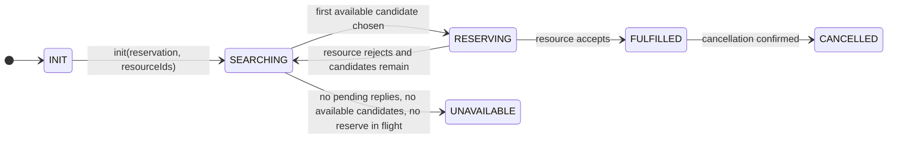

# Reservation State Machine

This document describes the post-rearchitecture reservation state machine.

The key design change is that the reservation starts with the full candidate `resourceId` set already known. Search completion is therefore deterministic: Rez does not need a business timeout to decide that a reservation is `UNAVAILABLE`.

## Design Rules

- A reservation starts with all candidate resources known in advance.
- Availability checks are advisory and do not lock a resource.
- The only lock point is `ResourceEntity.reserve()` accepting and persisting `ReservationAccepted`.
- `UNAVAILABLE` means the known candidate set has been exhausted.
- A watchdog may still exist for operational alerting, but it must not be the normal mechanism that decides search failure.

## Reservation Lifecycle

## State Meaning

- `INIT`: reservation does not exist yet.
- `SEARCHING`: the reservation is collecting availability replies and may also have a backlog of already-known available candidates to try.
- `RESERVING`: one concrete resource is being asked to lock the slot.
- `FULFILLED`: one resource accepted and the reservation is complete.
- `UNAVAILABLE`: every known candidate has been ruled out.
- `CANCELLED`: a fulfilled reservation was later cancelled.

## Exhaustion Rule

A reservation becomes `UNAVAILABLE` only when all of these are true:

- every candidate resource has replied or otherwise been accounted for
- there is no currently selected resource being reserved
- there is no remaining available candidate to try

That rule replaces the old timer-based `SearchExhausted` path.

## Suggested Reservation-Side Bookkeeping

To implement this cleanly, the reservation should track these sets explicitly:

- `candidateResourceIds`: full input set from the caller
- `pendingAvailability`: resources still expected to reply to the availability fan-out
- `availableCandidates`: resources that replied `available=true` and have not been tried yet
- `triedOrRejected`: resources already attempted and rejected, or ruled out as unavailable
- `selectedResourceId`: optional current reserve-in-flight target

This avoids inferring completion indirectly from elapsed time.
