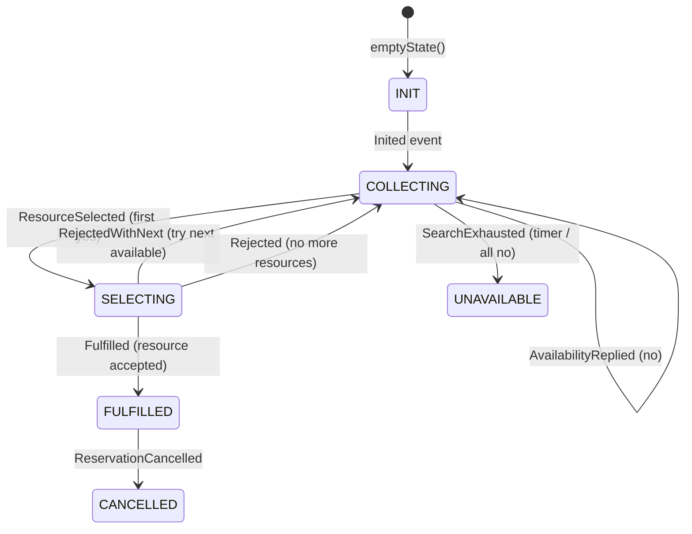

# ReservationEntity State Machine

```mermaid
stateDiagram-v2
    [*] --> INIT : emptyState()
    INIT --> COLLECTING : Inited event
    COLLECTING --> COLLECTING : AvailabilityReplied (no)
    COLLECTING --> SELECTING : ResourceSelected (first yes)
    COLLECTING --> UNAVAILABLE : SearchExhausted (timer / all no)
    SELECTING --> FULFILLED : Fulfilled (resource accepted)
    SELECTING --> COLLECTING : RejectedWithNext (try next available)
    SELECTING --> COLLECTING : Rejected (no more resources)
    FULFILLED --> CANCELLED : ReservationCancelled
```
